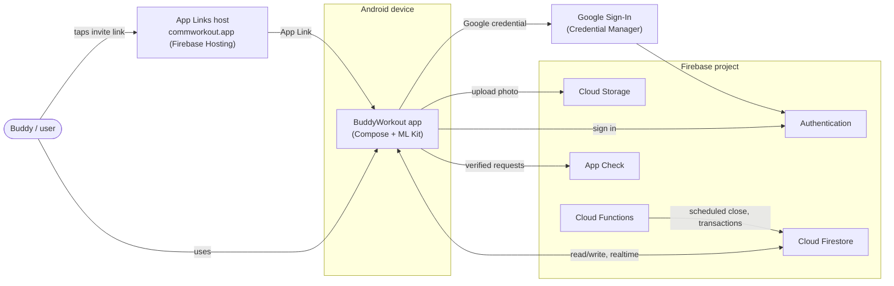
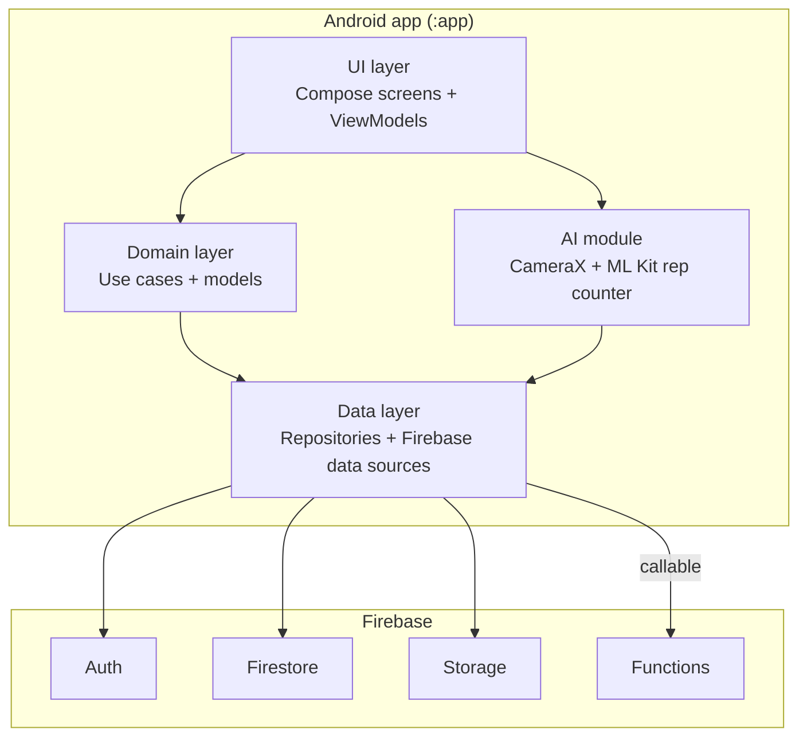
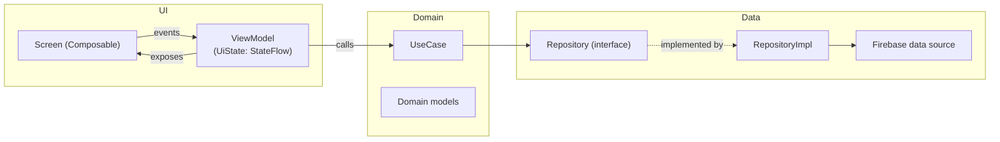
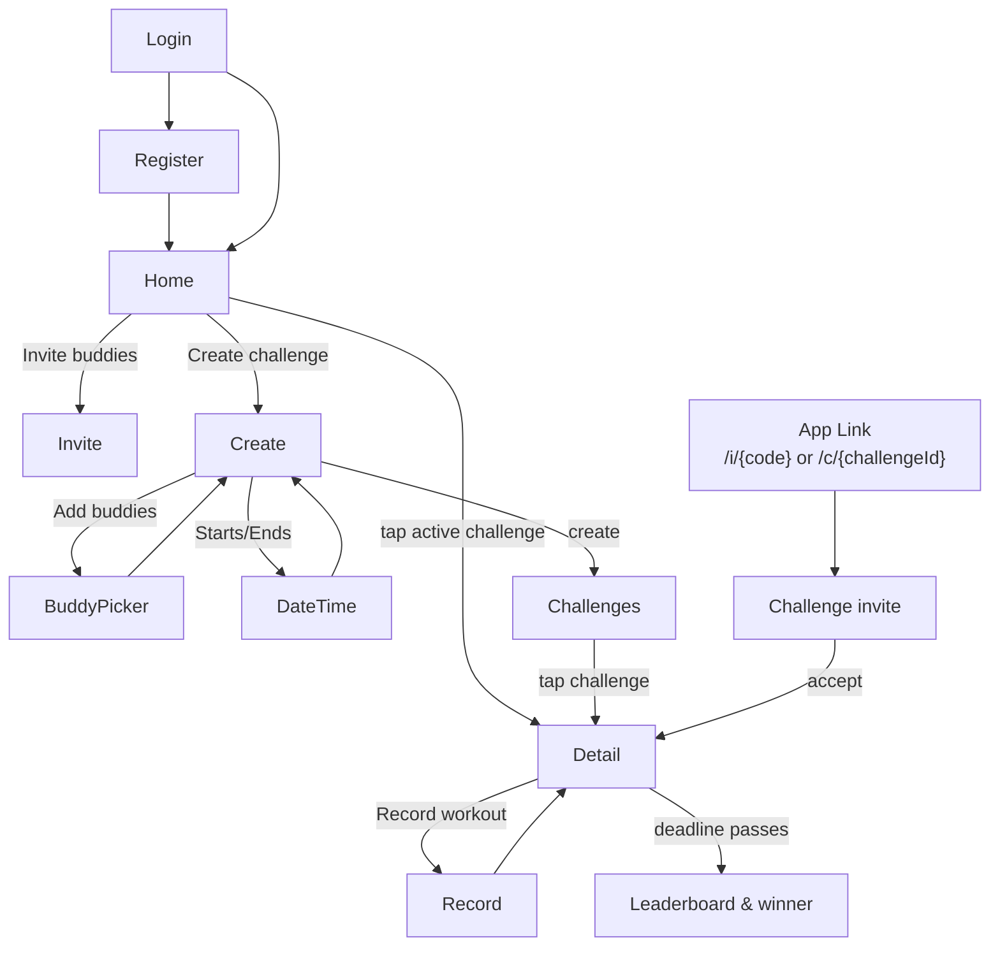

# 01 · High-Level Design (HLD)

## 1. Purpose & context

BuddyWorkout is a **serverless mobile app**: a Jetpack Compose Android client backed entirely by **Firebase** managed services. There is no custom application server for the MVP — the client talks to Firebase SDKs directly, and the only server-side code is a small set of **Cloud Functions** for things that must not be trusted to the client (closing challenges at the deadline, declaring winners).

### System context

On-device ML Kit Pose Detection runs fully offline; only the resulting rep counts are written to Firestore.

## 2. Tech stack

| Layer | Choice | Notes |
|------|--------|-------|
| Language | Kotlin 2.0.21 | Coroutines + Flow for async/reactive |
| UI | Jetpack Compose + Material 3 | Compose BOM 2024.09.00 |
| Navigation | Navigation-Compose | Type-safe routes; deep-link entry for invites |
| Architecture | MVVM + Repository (light Clean) | `ui → domain → data` |
| DI | Hilt | Wires repositories, Firebase, analyzers |
| Async | Coroutines, Flow, `callbackFlow` | Firestore snapshot listeners → `Flow` |
| Auth | Firebase Auth + Credential Manager | Email/Password + Google |
| Datastore | Cloud Firestore | Realtime, offline cache on by default |
| Files | Cloud Storage | Profile photos |
| Server logic | Cloud Functions (Node/TS) | Deadline close, winner calc, guarded writes |
| Invites | Android App Links + Firestore invite codes | **Not** Firebase Dynamic Links (sunset) |
| Camera | CameraX | `ImageAnalysis` feeds the pose detector |
| AI | ML Kit Pose Detection (bundled) | On-device rep counting |
| Images | Coil | Avatar/photo loading |
| Integrity | Firebase App Check (Play Integrity) | Blocks non-app traffic to Firestore/Functions |
| Build | Gradle (KTS) + version catalog | AGP 9.0.1 |

## 3. Container / module view

The MVP ships as a **single Gradle module** (`:app`) with clear internal packages (see [04-lld-android.md](04-lld-android.md)). Splitting into `:core`, `:feature-*` modules is a deliberate post-MVP step, noted but not done now to avoid premature structure.

## 4. App layering

- **Screens** are stateless Composables driven by a `UiState` from the ViewModel; user intents flow back as events.
- **ViewModels** hold `StateFlow<UiState>`, call use cases, never touch Firebase directly.
- **Use cases** carry one unit of business logic (e.g. `CreateChallengeUseCase` enforces the 2-active rule).
- **Repositories** expose domain models and `Flow`s; implementations adapt Firestore/Auth/Storage. Swapping Firebase later only touches the data layer.

## 5. Navigation map

Mirrors the 12 designed screens across 5 flows.

`MainActivity` hosts a single `NavHost`. A start-destination gate routes to `Login` or `Home` based on `FirebaseAuth.currentUser`. Invite App Links are handled as nav deep links.

## 6. Cross-cutting concerns

| Concern | Approach |
|--------|----------|
| Auth state | Single source: `AuthRepository.authState: Flow<AuthUser?>`; gate at nav root |
| Realtime | Firestore snapshot listeners wrapped as `Flow` (`callbackFlow`); leaderboards update live |
| Offline | Firestore offline persistence (default on); reps written while offline sync on reconnect |
| Consistency | Multi-doc updates (join, rep increment, close) done via Firestore **transactions** / `FieldValue.increment`, server-authoritative for close |
| Time | Server timestamps (`FieldValue.serverTimestamp()`); never trust device clock for deadlines |
| Security | Firestore Security Rules + App Check; sensitive transitions in Cloud Functions |
| Errors | `Result`-style sealed outcomes from repos → `UiState.Error` with ret] |
| Config | `google-services.json` per environment; `BuildConfig` flags |

## 7. Key quality attributes (NFRs)

- **Latency:** leaderboard updates feel instant via local cache + listener; pose detection runs at ≥15 fps on mid-range devices.
- **Cost:** stay on Firebase **Spark (free)** where possible; only Cloud Functions force **Blaze** (pay-as-you-go) — see [02-firebase-design.md](02-firebase-design.md) §7.
- **Privacy:** camera frames never leave the device; only counts are uploaded.
- **Scalability:** Firestore scales horizontally; data model avoids unbounded fan-out (see denormalization in [03-data-model.md](03-data-model.md)).
- **Testability:** repositories are interfaces → fakes in unit tests; the rep counter's state machine is pure and unit-tested without a camera.

## 8. Risks / decisions to revisit

| Topic | MVP decision | Revisit when |
|------|--------------|--------------|
| Dynamic Links | Sunset → use **App Links** | — (already decided) |
| Cloud Functions | Needed for trustworthy deadline-close → **Blaze plan** | If staying free: lazy client-side finalize (less reliable) |
| Anti-cheat | Trust client rep writes, validate ranges in rules | Cheating observed → move rep writes behind a callable Function |
| Modularization | Single `:app` module | Team/feature growth |
| minSdk | 24 (as scaffolded) | ML Kit + CameraX both support 21+, so fine |
