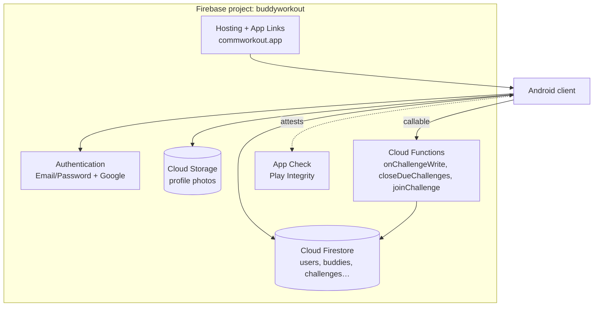
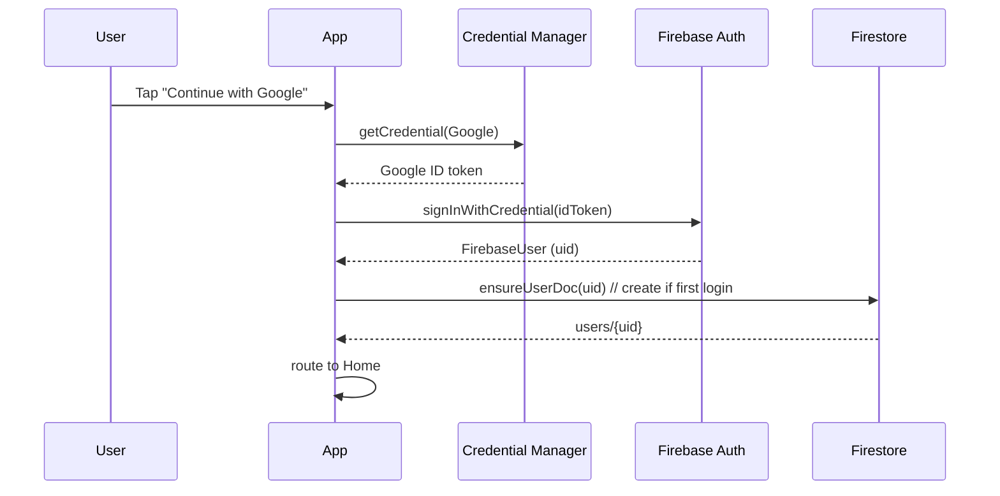
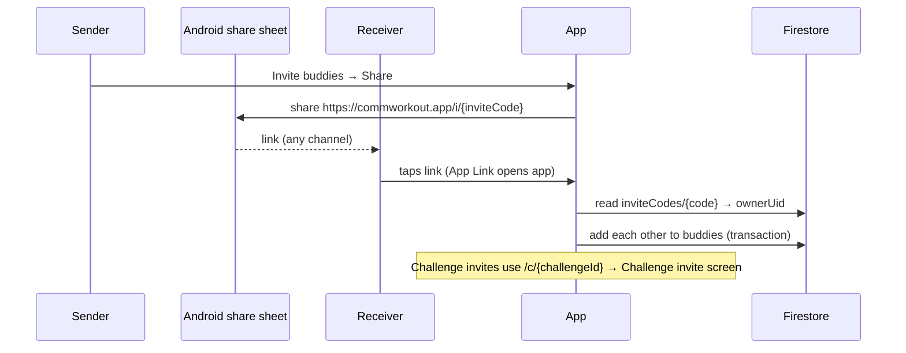
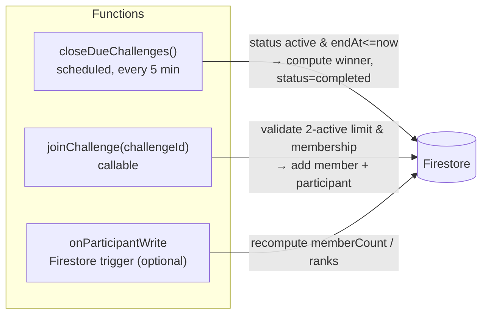

# 02 · Firebase as the backend

This is the heart of the MVP: **Firebase is the entire backend.** This doc explains how each Firebase product is used, why, and where the trust boundary sits. The detailed Firestore schema lives in [03-data-model.md](03-data-model.md).

## 1. Services used



| Service | Role in MVP | Plan |
|--------|-------------|------|
| Authentication | Identity (email/pass + Google) | Free |
| Cloud Firestore | Primary datastore + realtime + offline | Free tier, then usage |
| Cloud Storage | Profile photos | Free tier, then usage |
| Cloud Functions | Server-authoritative logic (close, winner, guarded join) | **Blaze required** |
| App Check | Block non-app traffic | Free |
| Hosting | Host `assetlinks.json` for App Links + invite landing | Free |

## 2. Authentication



- **Email/Password** and **Google** (via the modern **Credential Manager** API, not the deprecated `GoogleSignInClient`).
- On first successful sign-in, the client **provisions `users/{uid}`** (displayName, photoUrl, email, a generated `inviteCode`). Idempotent — safe to call every launch.
- `AuthRepository.authState: Flow<AuthUser?>` is the single source of truth used by the nav gate.
- Phone is an optional profile field, **not** a phone-auth method in MVP.

## 3. Firestore as the data plane

Firestore is chosen over Realtime Database for richer queries (leaderboard ordering, membership filters), structured subcollections, and transactions.

Top-level layout (full schema in [03-data-model.md](03-data-model.md)):

```
users/{uid}
users/{uid}/buddies/{buddyUid}
inviteCodes/{code}                       -> { ownerUid }
challenges/{challengeId}
challenges/{challengeId}/participants/{uid}
challenges/{challengeId}/sessions/{sessionId}
```

Access patterns and how Firestore serves them:

| Pattern | Query |
|--------|-------|
| My active challenges (Home) | `challenges where memberUids array-contains uid and status == 'active'` |
| Live leaderboard | listen `challenges/{id}/participants orderBy totalReps desc` |
| My buddies (picker) | `users/{uid}/buddies orderBy displayName` |
| Resolve invite | `inviteCodes/{code}` → ownerUid; or `challenges/{id}` directly |

### Realtime + offline
Snapshot listeners power live leaderboards and challenge state. Offline persistence (on by default) lets a user **record reps without connectivity**; writes queue and sync on reconnect. Rep increments use `FieldValue.increment(n)` so concurrent updates from multiple members merge correctly.

## 4. Invite deep links (App Links, not Dynamic Links)

> **Why not Firebase Dynamic Links?** It has been **deprecated and shut down**. We use **Android App Links** + a small Firestore-backed code instead.



- Host `https://commworkout.app/.well-known/assetlinks.json` on **Firebase Hosting** to verify the App Link to our package + signing cert.
- Two link shapes: `/i/{inviteCode}` (become buddies) and `/c/{challengeId}` (open a specific challenge invite).
- If the app isn't installed, the Hosting page shows a Play Store fallback (deferred join is post-MVP).

## 5. Cloud Functions (the only server code)

Three responsibilities the client must **not** own:



- **`closeDuechallenges` (scheduled, ~5 min):** finds `status == active && endAt <= now`, picks the top `totalReps` participant as `winnerUid`, sets `status = completed`. This is the **authoritative** close — auto-complete only, matching the product rule (no early win).
- **`joinChallenge` (callable):** server-validates the **max-2-active** invariant and membership before mutating, so the limit can't be bypassed by a tampered client. Mirrors `createChallenge` validation.
- **`onParticipantWrite` (optional trigger):** keep `memberCount` / cached ranks consistent. Can be deferred — ranks are also derivable client-side from the ordered query.

**MVP-lite fallback (stay on free Spark plan):** skip Functions and do **lazy finalization** — when any member opens a challenge whose `endAt` has passed, the client runs a transaction to compute the winner and flip `status`. Cheaper, but a challenge with no one opening it stays "active" until someone does, and the limit check is client-trusted. Recommended only for an early demo; move to Functions before real users.

## 6. Cloud Storage

- Profile photos at `users/{uid}/profile.jpg`. Client compresses to ~512px before upload; stores the download URL on `users/{uid}.photoUrl`.
- Rules: a user may write only their own path; photos are world-readable (avatars shown to buddies). No workout media is ever uploaded — frames stay on-device.

## 7. Security model

Defense in depth: **App Check** (is this our real app?) + **Security Rules** (is this user allowed?) + **Functions** (is this state transition valid?).

Security Rules sketch (full version ships in `firestore.rules`):

```
match /users/{uid} {
  allow read: if isSignedIn();
  allow write: if request.auth.uid == uid;
  match /buddies/{b} { allow read, write: if request.auth.uid == uid; }
}
match /challenges/{cid} {
  allow read: if isMember(cid);
  allow create: if request.auth.uid == request.resource.data.creatorUid
                && request.resource.data.memberUids.size() <= 4;
  // status/winner transitions restricted to Functions (server) only:
  allow update: if isMember(cid) && onlyMutableFieldsChanged();

  match /participants/{uid} {
    allow read: if isMember(cid);
    // a user may only bump their OWN reps, and only upward, while active:
    allow update: if request.auth.uid == uid
                  && get(/databases/$(db)/documents/challenges/$(cid)).data.status == 'active'
                  && request.resource.data.totalReps >= resource.data.totalReps;
  }
  match /sessions/{sid} {
    allow create: if request.auth.uid == request.resource.data.uid;
  }
}
```

- `status`, `winnerUid`, `memberUids` are **not** client-writable to arbitrary values — closing and joining go through Functions.
- Rep writes are constrained to the owner, monotonic, and only while `active`. Range validation (e.g. a session can't add 10 000 reps) is added as an anti-cheat hardening step.

## 8. Plan & cost

| Item | Free (Spark) | Needs Blaze |
|------|--------------|-------------|
| Auth, Firestore, Storage, App Check, Hosting | ✅ within quotas | — |
| Cloud Functions | ❌ | ✅ (pay per invocation; pennies at MVP scale) |

A scheduled 5-min close function ≈ 8.6k invocations/month — well within typical free Blaze credits, but Blaze (a billing account) must be enabled. **Decision needed from you:** enable Blaze for trustworthy auto-close, or run MVP-lite lazy finalization on Spark first.

## 9. Environment setup (one-time)

1. Create Firebase project, add Android app with package `com.example.buddyworkout`, download `google-services.json` into `app/`.
2. Enable Auth providers (Email/Password, Google), Firestore (production mode), Storage.
3. Add SHA-1/SHA-256 signing certs (needed for Google Sign-In + App Links).
4. Deploy `firestore.rules`, `firestore.indexes.json`, `storage.rules`.
5. (If Blaze) `firebase deploy --only functions`.
6. Host `assetlinks.json` for App Links.
