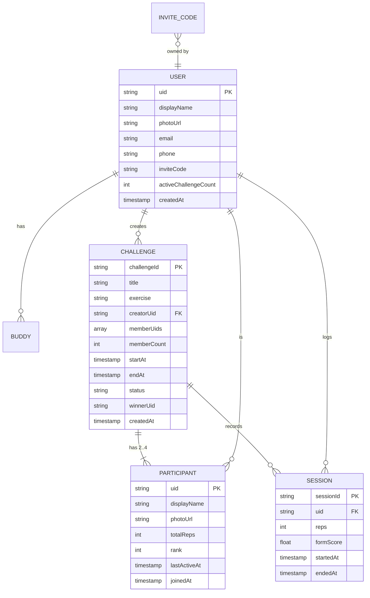
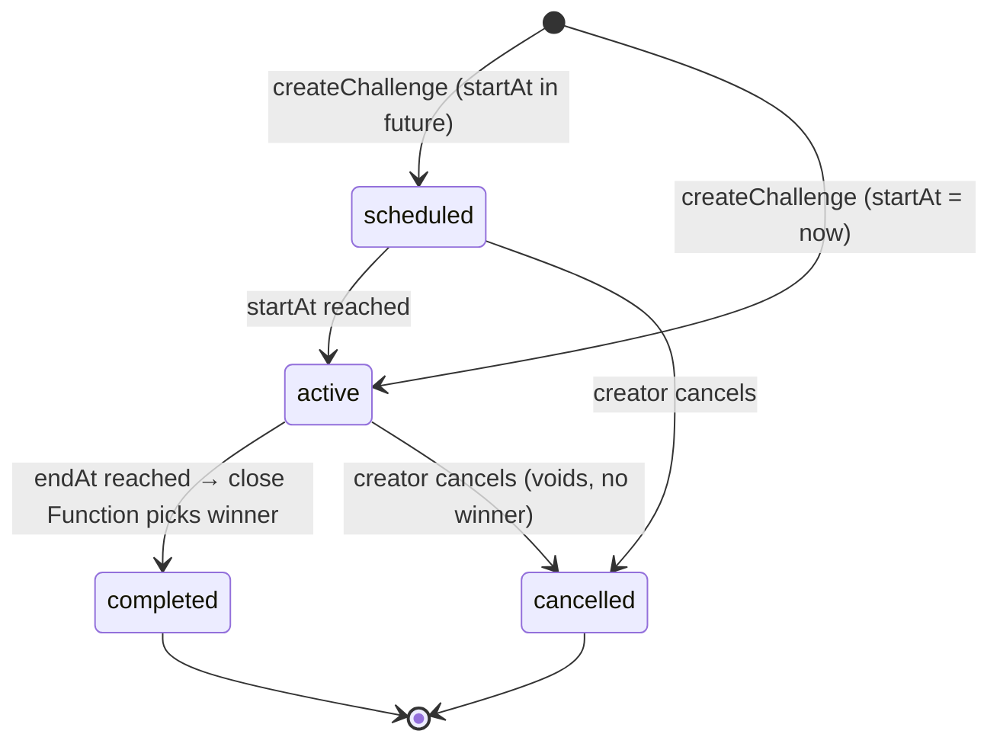
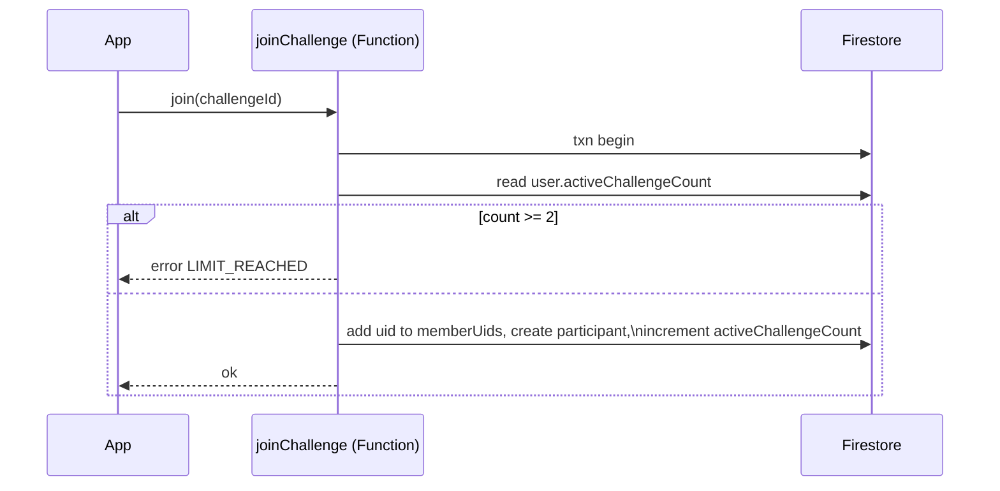

# 03 · LLD — Firestore data model

Concrete schema for the Firebase backend in [02-firebase-design.md](02-firebase-design.md). Firestore is schemaless; this is the **contract** the app and rules enforce.

## 1. Entity relationships

## 2. Collections & fields

### `users/{uid}`
| Field | Type | Notes |
|------|------|-------|
| `displayName` | string | from Auth/registration |
| `photoUrl` | string? | Storage download URL |
| `email` | string | |
| `phone` | string? | optional, profile only |
| `inviteCode` | string | short unique code; mirrored in `inviteCodes/` |
| `activeChallengeCount` | int | denormalized counter; enforces the **max-2** rule cheaply |
| `createdAt` | timestamp | server time |

### `users/{uid}/buddies/{buddyUid}`
| Field | Type | Notes |
|------|------|-------|
| `displayName` | string | denormalized for the buddy list/picker |
| `photoUrl` | string? | denormalized avatar |
| `since` | timestamp | when the buddy link formed |

> Buddy links are written **both ways** (A→B and B→A) when an invite is accepted.

### `inviteCodes/{code}`
| Field | Type | Notes |
|------|------|-------|
| `ownerUid` | string | resolves a `/i/{code}` App Link to a user |

### `challenges/{challengeId}`
| Field | Type | Notes |
|------|------|-------|
| `title` | string | always `"Pushup challenge"` in MVP (generic) |
| `exercise` | string | `"pushups"` |
| `creatorUid` | string | |
| `memberUids` | array<string> | 2–4 uids; powers `array-contains` membership query |
| `memberCount` | int | denormalized size of `memberUids` |
| `startAt` | timestamp | |
| `endAt` | timestamp | drives auto-close |
| `status` | string | `scheduled` \| `active` \| `completed` \| `cancelled` |
| `winnerUid` | string? | set by close Function |
| `createdAt` | timestamp | |

### `challenges/{challengeId}/participants/{uid}`
| Field | Type | Notes |
|------|------|-------|
| `displayName`, `photoUrl` | string | denormalized for leaderboard render |
| `totalReps` | int | updated via `FieldValue.increment` |
| `rank` | int? | optional cache; also derivable from ordered query |
| `lastActiveAt` | timestamp | "2 min ago" on the live board |
| `joinedAt` | timestamp | |

### `challenges/{challengeId}/sessions/{uid_sessionId}`
| Field | Type | Notes |
|------|------|-------|
| `uid` | string | who recorded |
| `reps` | int | reps in this session |
| `formScore` | float | 0–1, avg form quality (from the AI) |
| `startedAt` / `endedAt` | timestamp | |

## 3. Challenge state machine

- **Auto-complete only.** The only path to `completed` is the deadline + close Function. No participant or creator can declare an early winner.
- **Cancel** (creator-only) → `cancelled`: no winner, and it decrements every member's `activeChallengeCount`, freeing slots.
- `completed`/`cancelled` both decrement `activeChallengeCount` for all members.

## 4. The "max 2 active challenges" invariant

Enforced in two places (belt + braces):

1. **Counter:** `users/{uid}.activeChallengeCount`, mutated in the same transaction that creates/joins/closes/cancels. Create/join is rejected if any member's count is already 2.
2. **Server validation:** `createChallenge` / `joinChallenge` Cloud Functions re-check the counter (and recount active challenges if drift is suspected) so a tampered client can't exceed it.

## 5. Indexes

| Query | Index |
|------|-------|
| `memberUids array-contains uid` + `status ==` + `orderBy endAt` | composite (array-contains + status + endAt) |
| `participants orderBy totalReps desc` | single-field (auto) |
| close Function: `status == 'active'` + `endAt <=` | composite (status + endAt) |

Composite indexes are declared in `firestore.indexes.json` and deployed with the rules.

## 6. Denormalization rationale

- `displayName`/`photoUrl` copied onto `buddies` and `participants` so list/leaderboard renders need **no extra reads** (and no N+1 fan-out).
- `memberUids` as an array enables a single membership query for Home; capped at 4 so the array stays tiny.
- `activeChallengeCount` avoids a count-query on every create/join.
- Trade-off: on profile photo change we must update copies. Acceptable — photos rarely change, and a Function can fan out the update if needed.
