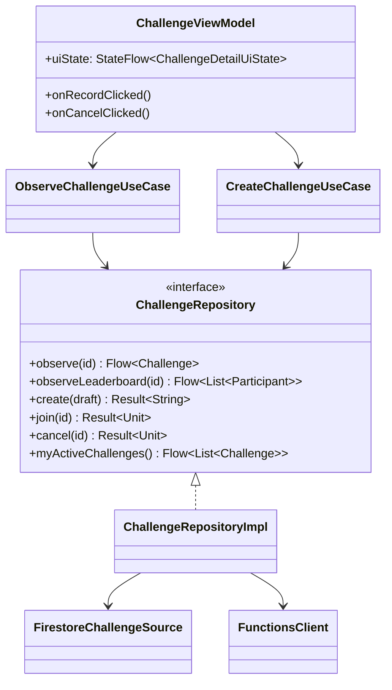
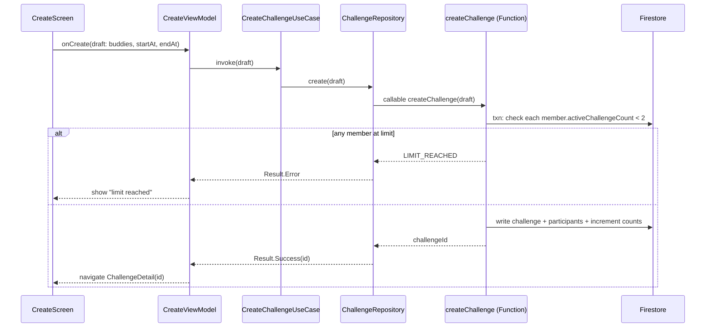
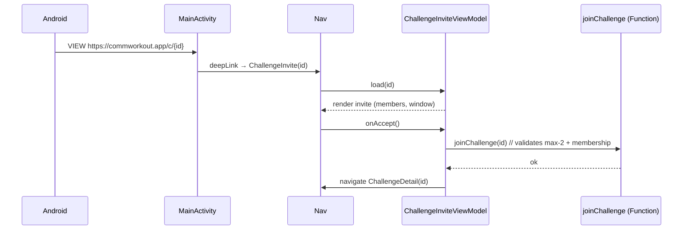
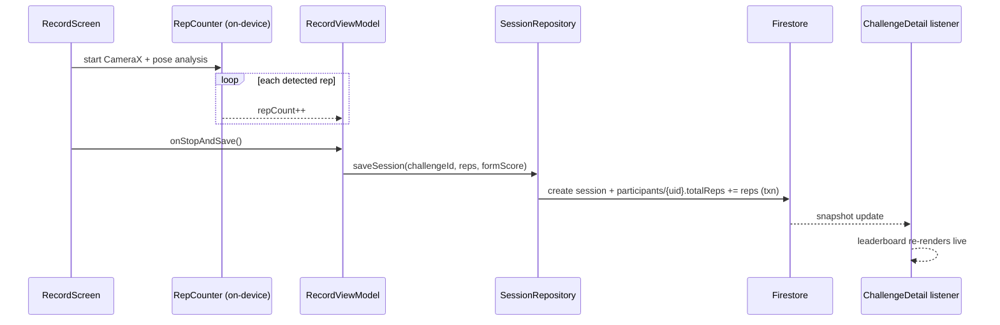

# 04 · LLD — Android app

Low-level design of the Compose client: package layout, the classes per layer, how they wire to Firebase, and sequence diagrams for the main flows. Base package: `com.example.buddyworkout`.

## 1. Package structure

```
com.example.buddyworkout
├─ BuddyWorkoutApp.kt              // @HiltAndroidApp Application
├─ MainActivity.kt                 // hosts NavHost + theme
├─ core/
│  ├─ di/                          // Hilt modules (Firebase, repos, dispatchers)
│  ├─ navigation/                  // routes, NavGraph, deep-link handling
│  ├─ ui/                          // shared composables, theme, components
│  └─ common/                      // Result, dispatchers, time, extensions
├─ data/
│  ├─ auth/                        // AuthRepositoryImpl, FirebaseAuthSource
│  ├─ user/                        // UserRepositoryImpl, buddies
│  ├─ challenge/                   // ChallengeRepositoryImpl, Firestore source, Functions client
│  ├─ workout/                     // SessionRepositoryImpl (reps/sessions)
│  └─ model/                       // Firestore DTOs + mappers to domain
├─ domain/
│  ├─ model/                       // User, Buddy, Challenge, Participant, Session
│  └─ usecase/                     // CreateChallengeUseCase, JoinChallengeUseCase, ...
├─ feature/
│  ├─ auth/                        // login, register (Screen + ViewModel)
│  ├─ home/
│  ├─ invite/                      // invite buddies + buddy picker
│  ├─ challenge/                   // create, detail (live leaderboard), challenges tab
│  ├─ record/                      // camera + rep counter UI  (see 05-lld-pushup-counter.md)
│  └─ result/                      // leaderboard & winner
└─ ai/                             // CameraX + ML Kit (PoseAnalyzer, RepCounter)
```

## 2. Layer responsibilities & key types



- **Repositories return domain models and `Flow`s.** Firestore DTOs (`*Doc`) live in `data/model` with mappers; the rest of the app never sees Firestore types.
- **Realtime bridge:** `FirestoreChallengeSource` wraps `addSnapshotListener` in `callbackFlow { ... awaitClose { reg.remove() } }`.
- **Writes that must be server-authoritative** (create/join enforcing max-2, cancel) go through `FunctionsClient` (callable functions); plain rep bumps go direct to Firestore with `FieldValue.increment`.

## 3. Dependency injection (Hilt)

```kotlin
@Module @InstallIn(SingletonComponent::class)
object FirebaseModule {
  @Provides @Singleton fun auth() = Firebase.auth
  @Provides @Singleton fun firestore() = Firebase.firestore.apply {
    firestoreSettings = firestoreSettings { isPersistenceEnabled = true }
  }
  @Provides @Singleton fun functions() = Firebase.functions
  @Provides @Singleton fun storage() = Firebase.storage
}

@Module @InstallIn(SingletonComponent::class)
abstract class RepositoryModule {
  @Binds abstract fun authRepo(impl: AuthRepositoryImpl): AuthRepository
  @Binds abstract fun challengeRepo(impl: ChallengeRepositoryImpl): ChallengeRepository
  // …user, session repos
}
```

ViewModels are `@HiltViewModel` and receive use cases (or repositories for simple screens) via constructor injection.

## 4. Navigation & deep links

```kotlin
sealed interface Route {
  data object Login; data object Register; data object Home
  data object Invite; data object Create; data object BuddyPicker
  data class ChallengeDetail(val id: String)
  data class ChallengeInvite(val id: String)   // from /c/{id}
  data class Record(val challengeId: String)
  data class Result(val challengeId: String)
}
```

- `NavHost` start destination chosen by `authState`: `Login` when null, else `Home`.
- App Links registered in the manifest for `https://commworkout.app/i/*` and `/c/*`, mapped to nav `deepLinks`.

## 5. Sequence diagrams (main flows)

### 5.1 Create challenge (enforces max-2)



### 5.2 Accept invite via App Link



### 5.3 Record workout → live leaderboard



### 5.4 Deadline auto-close

```mermaid
sequenceDiagram
    participant Sch as Scheduler (every 5 min)
    participant Fn as closeDueChallenges
    participant FS as Firestore
    Sch->>Fn: trigger
    Fn->>FS: query status==active && endAt<=now
    loop each due challenge
      Fn->>FS: txn: winner = top totalReps; status=completed;\ndecrement each member.activeChallengeCount
    end
    Note over FS: clients listening see status=completed → Winner screen
```

## 6. UI state pattern

```kotlin
sealed interface ChallengeDetailUiState {
  data object Loading : ChallengeDetailUiState
  data class Data(
    val challenge: Challenge,
    val leaderboard: List<Participant>,
    val timeRemaining: Duration,
    val isCreator: Boolean,
  ) : ChallengeDetailUiState
  data class Error(val message: String) : ChallengeDetailUiState
}
```

ViewModel `combine`s the challenge `Flow`, leaderboard `Flow`, and a 1-second ticker (for the countdown) into one `StateFlow`.

## 7. Gradle dependencies to add

`gradle/libs.versions.toml` (new entries):

```toml
[versions]
firebaseBom = "33.7.0"
hilt = "2.52"
navigationCompose = "2.8.5"
camerax = "1.4.1"
mlkitPose = "18.0.0-beta5"
coil = "2.7.0"
credentials = "1.3.0"
googleid = "1.1.1"
coroutinesPlayServices = "1.9.0"

[libraries]
firebase-bom = { group = "com.google.firebase", name = "firebase-bom", version.ref = "firebaseBom" }
firebase-auth = { group = "com.google.firebase", name = "firebase-auth" }
firebase-firestore = { group = "com.google.firebase", name = "firebase-firestore" }
firebase-storage = { group = "com.google.firebase", name = "firebase-storage" }
firebase-functions = { group = "com.google.firebase", name = "firebase-functions" }
firebase-appcheck = { group = "com.google.firebase", name = "firebase-appcheck-playintegrity" }
hilt-android = { group = "com.google.dagger", name = "hilt-android", version.ref = "hilt" }
hilt-compiler = { group = "com.google.dagger", name = "hilt-android-compiler", version.ref = "hilt" }
androidx-hilt-navigation-compose = { group = "androidx.hilt", name = "hilt-navigation-compose", version = "1.2.0" }
androidx-navigation-compose = { group = "androidx.navigation", name = "navigation-compose", version.ref = "navigationCompose" }
camera-camera2 = { group = "androidx.camera", name = "camera-camera2", version.ref = "camerax" }
camera-lifecycle = { group = "androidx.camera", name = "camera-lifecycle", version.ref = "camerax" }
camera-view = { group = "androidx.camera", name = "camera-view", version.ref = "camerax" }
mlkit-pose = { group = "com.google.mlkit", name = "pose-detection", version.ref = "mlkitPose" }
coil-compose = { group = "io.coil-kt", name = "coil-compose", version.ref = "coil" }
androidx-credentials = { group = "androidx.credentials", name = "credentials", version.ref = "credentials" }
androidx-credentials-play = { group = "androidx.credentials", name = "credentials-play-services-auth", version.ref = "credentials" }
googleid = { group = "com.google.android.libraries.identity.googleid", name = "googleid", version.ref = "googleid" }
coroutines-play-services = { group = "org.jetbrains.kotlinx", name = "kotlinx-coroutines-play-services", version.ref = "coroutinesPlayServices" }

[plugins]
google-services = { id = "com.google.gms.google-services", version = "4.4.2" }
hilt = { id = "com.google.dagger.hilt.android", version.ref = "hilt" }
ksp = { id = "com.google.devtools.ksp", version = "2.0.21-1.0.27" }
```

Then apply `google-services`, `hilt`, `ksp` in `app/build.gradle.kts`, add the deps, and drop `google-services.json` into `app/`.

> Order of build-out (see the implementation plan that follows this design): Gradle/Firebase wiring → auth → nav skeleton → Firestore challenge model → create/join → record (AI) → leaderboard/close.
