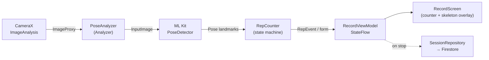
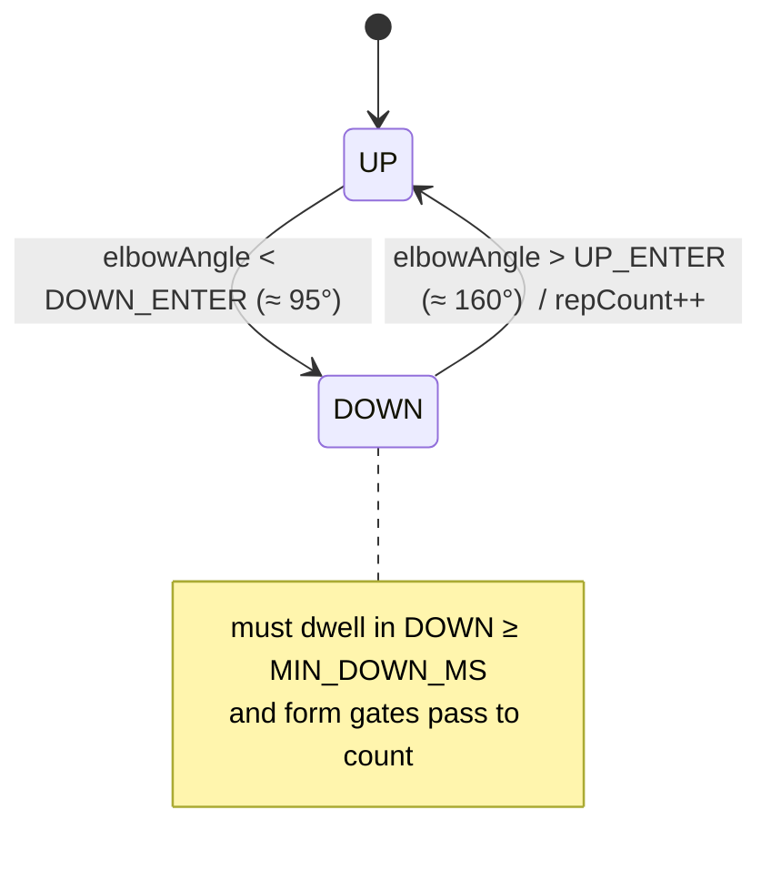
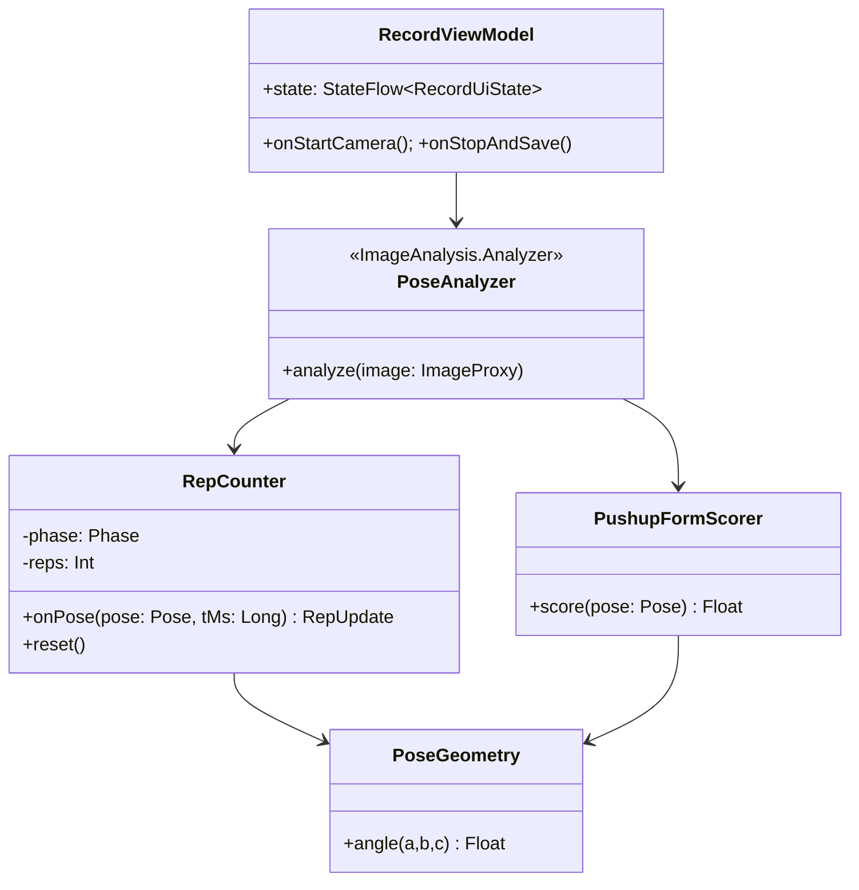
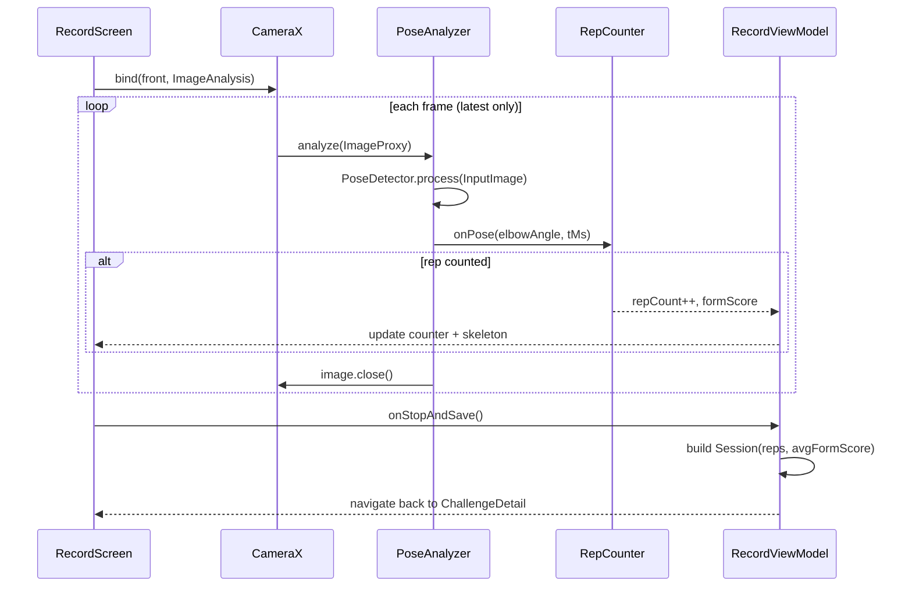

# 05 · LLD — AI pushup counter

The one genuinely novel piece: counting pushups **on-device** from the camera with ML Kit Pose Detection. Camera frames never leave the phone; only the final rep count + form score are written to Firestore.

## 1. Pipeline overview



- **CameraX** `ImageAnalysis` (front camera, `STRATEGY_KEEP_ONLY_LATEST`) delivers frames on a background executor.
- **ML Kit Pose Detection**, `PoseDetectorOptions.STREAM_MODE`, bundled model for offline use, fast over accurate for live counting.
- **RepCounter** is a pure state machine — no Android deps — so it unit-tests without a camera.

## 2. Rep-counting state machine

A pushup is detected by tracking the **elbow angle** (shoulder–elbow–wrist) and crossing two thresholds with hysteresis to avoid double-counting jitter.



| Constant | Value (tunable) | Why |
|---------|-----------------|-----|
| `DOWN_ENTER` | ~95° | bottom of a pushup |
| `UP_ENTER` | ~160° | near-lockout top |
| hysteresis gap | 65° | UP/DOWN thresholds differ → no flicker counting |
| `MIN_DOWN_MS` | ~250 ms | rejects twitches |
| `MIN_LANDMARK_CONF` | 0.5 | ignore low-confidence joints |

A rep is counted on the **DOWN→UP** transition (one full down-and-up). Both arms are averaged; if one side is occluded, the higher-confidence side is used.

## 3. Form scoring (lightweight)

Per-rep `formScore ∈ [0,1]` from cheap geometric checks, averaged over the session:

- **Depth:** did `elbowAngle` actually reach below `DOWN_ENTER`? (partial reps score lower)
- **Body line:** shoulder–hip–ankle near-straight (penalise sagging/piking) via hip angle.
- **Symmetry:** left/right elbow angles close.

Drives the "● Good form" chip live and the "Avg form score" stat on the result screen. Not used to reject reps in MVP (just informational) — tightening this is an anti-cheat lever later.

## 4. Classes



```kotlin
class RepCounter(
  private val downEnter: Float = 95f,
  private val upEnter: Float = 160f,
  private val minDownMs: Long = 250,
) {
  enum class Phase { UP, DOWN }
  private var phase = Phase.UP
  private var downSince = 0L
  var reps = 0; private set

  fun onPose(elbowAngle: Float, tMs: Long): Boolean {
    when (phase) {
      Phase.UP   -> if (elbowAngle < downEnter) { phase = Phase.DOWN; downSince = tMs }
      Phase.DOWN -> if (elbowAngle > upEnter && tMs - downSince >= minDownMs) {
                      phase = Phase.UP; reps++; return true   // counted
                    }
    }
    return false
  }
}
```

## 5. Recording sequence



## 6. Performance & threading

- Analysis runs on a dedicated single-thread executor; `STRATEGY_KEEP_ONLY_LATEST` drops backlog so UI never lags.
- Target ≥15 fps for responsive counting; ML Kit fast model handles this on mid-range devices.
- **Must** call `imageProxy.close()` every frame or the pipeline stalls.
- The skeleton overlay reads landmark coords off the latest pose; drawn on a Compose `Canvas` scaled to the preview.

## 7. Edge cases

| Case | Handling |
|------|----------|
| No person / partial body | low landmark confidence → no counting; show "Position yourself in frame" |
| Person leaves mid-rep | phase resets to UP after a confidence-loss timeout |
| Very fast reps | `MIN_DOWN_MS` floors cadence; tune per testing |
| Front vs back camera | default front (user watches screen); allow toggle |
| Permission denied | gate the screen with a CAMERA permission rationale |
| Background/stop | unbind CameraX in `onStop`; release detector |

## 8. Testing

- `RepCounter` and `PoseGeometry` are pure → JVM unit tests with synthetic angle sequences (e.g. feed an array of elbow angles, assert rep count).
- Form scorer tested with canned `Pose` fixtures.
- Camera/ML Kit integration validated manually on device (no emulator camera for pose).
